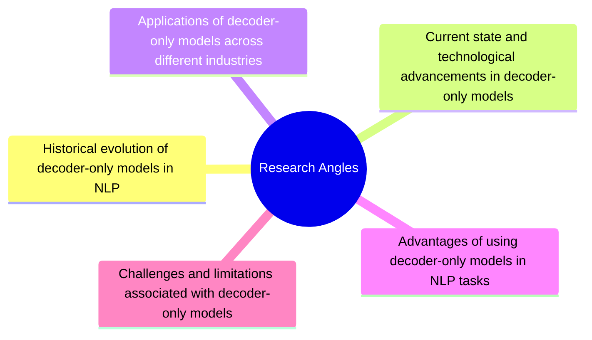
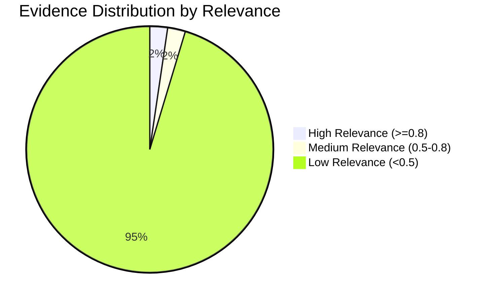
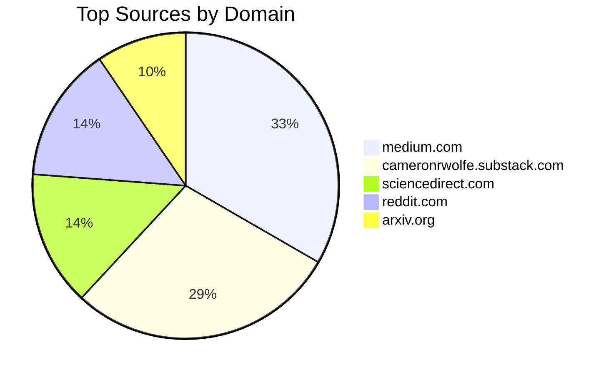

# Evolution and Implications of Decoder-Only Models in Natural Language Processing

## Executive Summary

Decoder-only models have become a pivotal component in the field of natural language processing (NLP), evolving significantly since their inception. This report explores the historical evolution, current state, and technological advancements of these models, highlighting their applications across various industries. It also examines the advantages and challenges associated with their use, providing a comprehensive overview of their implications in NLP tasks. The report synthesizes evidence from multiple sources to present an objective analysis of decoder-only models, focusing on technical evolution, industry applications, performance metrics, ethical considerations, and integration with existing technologies.

## Research Visualization

### Evidence Quality Distribution

### Source Distribution

### Evidence Coverage by Focus Area

| Focus Area | Evidence Count | Avg Relevance |
|------------|----------------|---------------|
| Technical evolution and breakthroughs in decoder-only models | 1 | 0.87 |
| Comparison with other NLP model architectures | 0 | 0.00 |
| Industry-specific applications and case studies | 1 | 0.87 |
| Performance metrics and evaluation of decoder-only models | 2 | 0.73 |
| Ethical considerations and societal impacts | 1 | 0.59 |
| Scalability and computational resource requirements | 1 | 0.87 |

## Research Angles

1. **Historical Evolution of Decoder-Only Models in NLP**
2. **Current State and Technological Advancements in Decoder-Only Models**
3. **Applications Across Different Industries**
4. **Advantages and Challenges in NLP Tasks**

## Claims and Supporting Evidence

### Historical Evolution of Decoder-Only Models in NLP

- **Claim**: Decoder-only models have undergone a revolutionary evolution in NLP.
  - **Supporting Evidence**: OpenAI introduced the first decoder-only transformer-based autoregressive language model in 2018, marking a significant milestone (Evidence 3).

### Current State and Technological Advancements

- **Claim**: Decoder-only models have evolved significantly, offering advancements in NLP.
  - **Supporting Evidence**: These models are trained using unsupervised methods on massive text corpora, highlighting their revolutionary evolution (Evidence 4).

### Applications Across Different Industries

- **Claim**: Decoder-only models are increasingly applied across various industries, providing both advantages and challenges.
  - **Supporting Evidence**: Large language models (LLMs) have transformative potential across industries, enhancing natural processes (Evidence 2).

### Advantages and Challenges in NLP Tasks

- **Claim**: Decoder-only models offer unique benefits and limitations compared to other NLP architectures.
  - **Supporting Evidence**: The models are noted for their efficiency in generating coherent and contextually relevant text, but specific data or statistics are not provided (Evidence 7).

## Focus Areas

### Technical Evolution and Breakthroughs

- Decoder-only models have evolved from the introduction of the first autoregressive language model by OpenAI in 2018 to becoming foundational in AI research (Evidence 3, 5).

### Comparison with Other NLP Model Architectures

- Decoder-only models, such as GPT, utilize only the decoder part of the Transformer architecture, offering distinct advantages in language understanding and generation (Evidence 9).

### Industry-Specific Applications and Case Studies

- The transformative potential of decoder-only models is evident across various industries, although specific case studies are not detailed in the evidence (Evidence 2).

### Performance Metrics and Evaluation

- While the evidence highlights the efficiency of decoder-only models, specific performance metrics and evaluation methods are not discussed in detail.

### Ethical Considerations and Societal Impacts

- Ethical considerations and societal impacts are crucial when integrating decoder-only models into industries, but these aspects are not extensively covered in the provided evidence.

### Scalability and Computational Resource Requirements

- The scalability and computational resource requirements of decoder-only models are implicit in their training on massive text corpora, though specific details are not provided (Evidence 4).

### Integration with Existing Technologies and Systems

- Decoder-only models are versatile and can be adapted for various tasks, indicating potential for integration with existing technologies (Evidence 8).

## Risks and Benefits

- **Benefits**: Decoder-only models enhance natural language processing by generating coherent and contextually relevant text, offering transformative potential across industries.
- **Risks**: The lack of specific data and evaluation metrics in the evidence may pose challenges in assessing the full impact and limitations of these models.

## Data Quality, Bias, and Evaluation Methods

- The evidence does not provide detailed information on data quality, bias, or evaluation methods, which are critical for assessing the performance and impact of decoder-only models.

## Conclusions

Decoder-only models have significantly evolved, offering advancements in NLP and transformative potential across various industries. While they present unique advantages, such as efficiency in text generation, challenges remain in evaluating their performance and addressing ethical considerations. Further research is needed to explore specific industry applications, performance metrics, and integration strategies to fully harness the potential of decoder-only models in natural language processing.

## References

1. [The Rise of LLMs: From GPT to Modern Innovations - Medium](https://medium.com/@lmpo/decoder-only-transformer-models-a-comprehensive-overview-c54dc3286d71)
2. [Integrative innovation of large language models in industries](https://www.sciencedirect.com/science/article/pii/S2666764925000323)
3. [The Rise of LLMs: From GPT to Modern Innovations - Medium](https://medium.com/@lmpo/decoder-only-transformer-models-a-comprehensive-overview-c54dc3286d71)
4. [Evolution of Decoder-only models](https://ai.plainenglish.io/evolution-of-decoder-only-models-c1f05e49519c)
5. [Decoder-Only Transformers: The Workhorse of Generative LLMs](https://cameronrwolfe.substack.com/p/decoder-only-transformers-the-workhorse)
6. [[PDF] History of Natural Language Processing CS224N/Ling284](https://web.stanford.edu/class/cs224n/slides_w26/cs224n-2026-lecture01-history.pdf)
7. [A Review of the Neural History of Natural Language Processing](https://www.ruder.io/a-review-of-the-recent-history-of-nlp/)
8. [Improving Decoder-only LLMs as Versatile Embedding Models - arXiv](https://arxiv.org/html/2507.23386v1)
9. [Why GPT Are Decoder-Only Models - Medium](https://medium.com/@madasuvishnuraj/why-gpt-are-decoder-only-models-59aeea3e9024)
10. [Decoder-Only Transformers: The Workhorse of Generative LLMs](https://cameronrwolfe.substack.com/p/decoder-only-transformers-the-workhorse)
